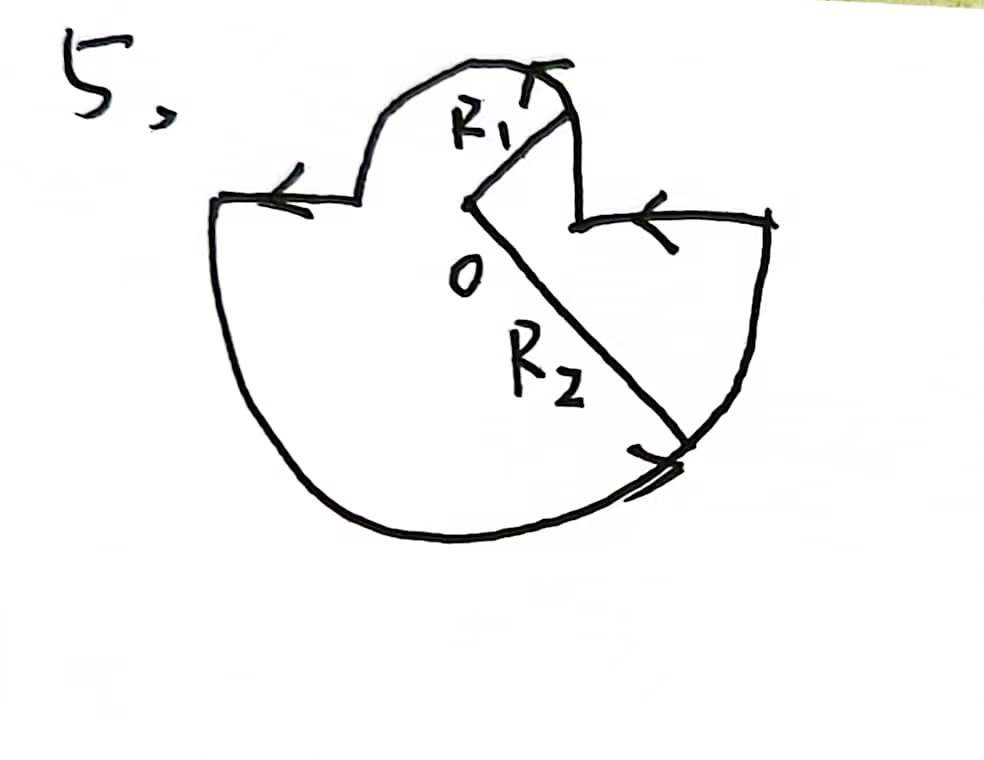

# 第1，3题
> 推导直线的毕萨公式：
> $$
> \begin{align*}
> d\vec{B}&=\frac{u_0I\cdot d\vec{l}\times \vec e_r}{4\pi r^2}\qquad u_0=4\pi\times10^{-7}N/A^2\\
> &=\frac{10^{-7}I\cdot d\vec{l}\times \vec e_r}{r^2}\\
&=\frac{10^{-7}I\cdot dl\cdot\sin\theta}{r^2}
> \end{align*}
> $$
> 因为：
> $$
\begin{align*}
r&=\frac{r_0}{\sin\theta}\\
l&=\frac{r_0}{\tan \theta}\qquad\Rightarrow dl=\frac{r_0d\theta}{\sin ^2\theta}
\end{align*}
>$$
> 所以：
> $$
\begin{align*}
d\vec{B}&=\frac{10^{-7}\cdot I}{r_0}\cdot \sin \theta d\theta
\end{align*}
$$
 
 

## 第1题
$$
\begin{align*}
d\vec{B}&=\frac{10^{-7}\cdot I}{r_0}\cdot \sin \theta d\theta\\
&=\frac{10^{-6}}{0.02}\cdot \sin \theta d\theta\\
&=5\times10^{-5} \sin \theta d\theta\\
B&=5\times10^{-5} \int_0^{\frac{\pi}{2}}\sin \theta d\theta\\
&=5\times10^{-5} \ T\\
\\
\qquad &方向：垂直纸面向里面
\end{align*}
$$
 

## 第3题
$$
\begin{align*}
d\vec{B}&=\frac{10^{-7}\cdot I}{r_0}\cdot \sin \theta d\theta\\
&=10^{-3}\cdot \sin \theta d\theta\\
\end{align*}
$$
俩边对称，一边俩段，所以：
$$
\begin{align*}
B&=2\{10^{-3}(\int_0^{\frac{\pi}{2}}\sin \theta d\theta+\int_{\frac{\pi}{6}}^{\frac{\pi}{2}}\sin \theta d\theta)\}\\
&=2\times10^{-3}\times(1+\frac{\sqrt{3}}{2})\\
&=3.73\times10^{-3}\ T\\
\\
\qquad &方向：垂直纸面向外
\end{align*}
$$
 
 
 
 
 

# 第5，11题
> 球形毕萨定律的推导：
> $$
\begin{align*}
d\vec B &=\frac{\mu_0Id\vec l\times\vec {e_r}}{4\pi r^2} \\
&=\frac{10^{-7}}{r^2}\cdot dl
\end{align*}
$$
## 第五题
### (1)
载流回路形状
 

### (2)
$$
\begin{align*}
\vec B_2&=\frac{10^{-7}}{R_2^2}\pi R_2\\
\frac{\vec B_2}{\vec B_1}&=\frac{R_1}{R_2}\\
\vec{B}&=\frac{R_1+R_2}{R_1}\vec B_2
\end{align*}
$$

## 第11题
半径为$r\rightarrow r+dr$ ，拥有匝数$\frac{N}{R_2-R_1}dr$

半径为$r$的$B$ : 
$$
\begin{align*}
d\vec{B}&=\frac{\mu_0Idl\times e^r}{4\pi r^2}\\
B&=\frac{\mu_0I}{2r}
\end{align*}
$$

$dr$中$B$ : 
$$
\begin{align*}
d\vec{B}&=\frac{\mu_0IN}{2(R_2-R_1)}\cdot\frac{dr}{r}\\
B&=\frac{\mu_0IN}{2(R_2-R_1)}\cdot\frac{\ln R_2}{\ln R_1}
\end{align*}
$$

# 第13题
> 圆柱磁场环路定理推导
> $$
\begin{align*}
\oint_L\vec B\cdot d\vec l&=\mu_0\sum_iI_i\\
2\pi R\vec B&=\mu_0I\\
\vec B&=\frac{\mu_0I}{2\pi R}
\end{align*}
> $$
- 圆形磁场 $B_1$ : 
$$
B_1=\frac{\mu_0I_2}{2R}
$$
- 直线磁场 $B_2$ : 
$$
B_2=\frac{\mu_0I_2}{2\pi R}

$$
- 圆柱型$B_3$(安培环路定理) : 
$$
B_3=\frac{\mu_0I_1}{2\pi(d+R)}
$$
所以合磁场强度为：
$$
B=\frac{\mu_0I_2}{2R}+\frac{\mu_0I_2}{2\pi R}+\frac{\mu_0I_1}{2\pi(d+R)}\\
方向：垂直纸面向里

$$

# 第15题
- 求$r$
$$
\begin{align*}
受力，F&=m\frac{v^2}{r}\\
安培力，F&=\frac{1}{4\pi \varepsilon_0}\frac{e^2}{r^2}\qquad\Rightarrow \\
r&=\frac{e^2}{4\pi\varepsilon_0mv^2}\\

\end{align*}
$$
- 求$I$
$$
\begin{align*}
I=\frac{e}{t}\\
=\frac{ev}{2\pi r}
\end{align*}
$$
所以：
$$
\begin{align*}
B&=\frac{\mu_0I}{2r}\\
&=\frac{\mu_0ev}{4\pi r^2}\\
&=\frac{4\pi v^5\varepsilon_0^2m^2\mu_0}{e^3}
\end{align*}
$$
# 第19题
$$
\begin{align*}
dΦ&=\vec B\cdot d\vec S\\
由数学知识\qquad Φ&=|\iiint\nabla \cdot\vec B\cdot dV-B\cos\alpha\pi R^2|\\
&=B\cos\alpha\pi R^2
\end{align*}
$$